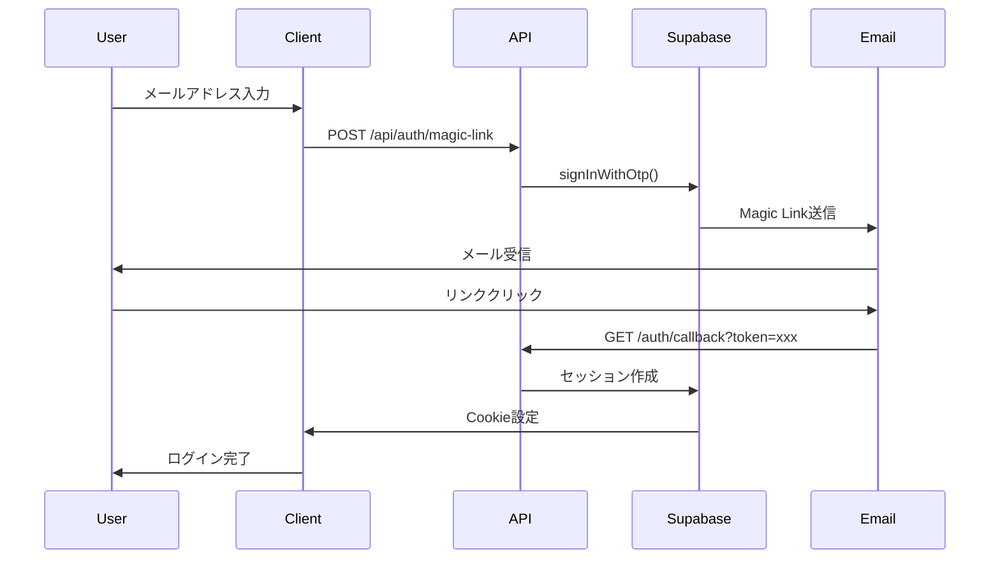
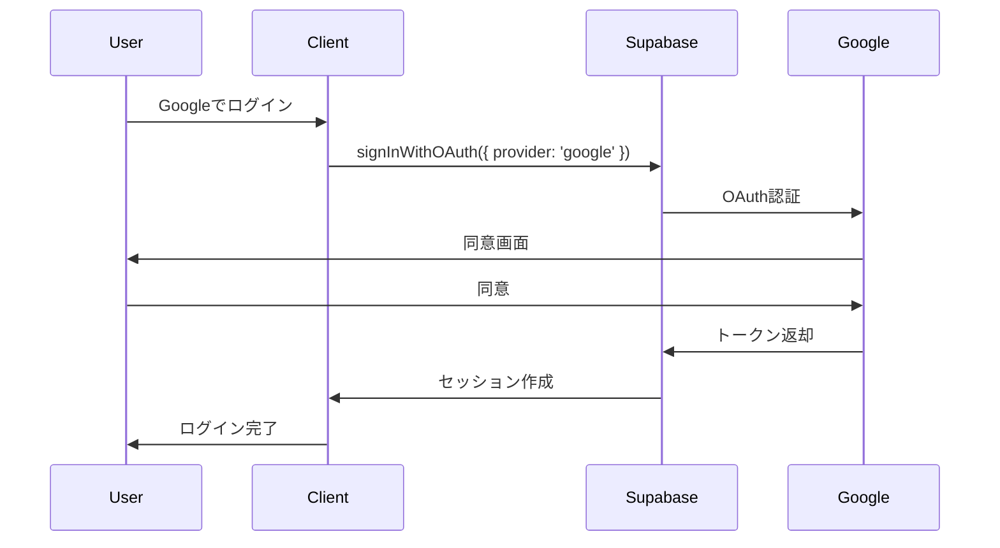

# API設計

> **参照Skill**: `backend-development` (ClaudeKit) - REST API設計、認証、セキュリティ

## 設計方針

### アーキテクチャ選択

**ちゅぶれびゅ！**は**Next.js App Router**を採用するため、従来のREST API Routesではなく**Server Actions**を主軸とします。

| アプローチ | 用途 | 採用 |
|-----------|------|------|
| **Server Actions** | データ変更（POST, PUT, DELETE） | ✅ 主軸 |
| **Server Components** | データ取得（GET） | ✅ 主軸 |
| **API Routes** | 外部Webhook、公開API | △ 最小限 |
| **GraphQL** | - | ❌ 不採用 |

### 設計原則（backend-development準拠）

1. **型安全性**: TypeScript + Zodでランタイム検証
2. **セキュリティファースト**: 認証・認可を全エンドポイントで実施
3. **エラーハンドリング**: 統一されたエラーレスポンス
4. **レート制限**: YouTube API保護、DDoS対策
5. **キャッシュ戦略**: 適切なデータフェッチング最適化

---

## データフェッチング戦略

### 1. Server Components（GET操作）

**用途**: データ読み取り専用

```typescript
// app/channels/[id]/page.tsx
export default async function ChannelPage({ 
  params 
}: { 
  params: { id: string } 
}) {
  // サーバー側で直接Supabaseにアクセス
  const { data: channel } = await supabase
    .from('channels')
    .select(`
      *,
      stats:channel_stats(*)
    `)
    .eq('id', params.id)
    .single();
  
  if (!channel) notFound();
  
  return <ChannelDetail channel={channel} />;
}
```

**メリット**:
- サーバー側で実行（セキュア）
- RLSポリシー適用
- SEO対応
- API Routes不要

---

### 2. Server Actions（POST/PUT/DELETE操作）

**用途**: データ変更操作

#### ファイル構成

```
app/
└── _actions/
    ├── channel.ts      # チャンネル関連
    ├── review.ts       # レビュー関連
    ├── user.ts         # ユーザー関連
    └── list.ts         # リスト関連
```

#### 実装例: レビュー投稿

**ファイル**: `app/_actions/review.ts`

```typescript
'use server';

import { z } from 'zod';
import { revalidatePath } from 'next/cache';
import { createClient } from '@/lib/supabase/server';
import { getUser } from '@/lib/auth';

// バリデーションスキーマ
const createReviewSchema = z.object({
  channelId: z.string().uuid(),
  rating: z.number().int().min(1).max(5),
  title: z.string().max(100).optional(),
  content: z.string().min(10).max(5000),
  isSpoiler: z.boolean().default(false),
});

export type CreateReviewInput = z.infer<typeof createReviewSchema>;

export async function createReview(input: CreateReviewInput) {
  try {
    // 1. バリデーション
    const validated = createReviewSchema.parse(input);
    
    // 2. 認証チェック
    const user = await getUser();
    if (!user) {
      return { 
        success: false, 
        error: 'Unauthorized' 
      };
    }
    
    // 3. Supabase操作
    const supabase = createClient();
    const { data, error } = await supabase
      .from('reviews')
      .insert({
        user_id: user.id,
        channel_id: validated.channelId,
        rating: validated.rating,
        title: validated.title,
        content: validated.content,
        is_spoiler: validated.isSpoiler,
      })
      .select()
      .single();
    
    if (error) {
      // 重複チェック（UNIQUE制約違反）
      if (error.code === '23505') {
        return {
          success: false,
          error: 'You have already reviewed this channel',
        };
      }
      
      throw error;
    }
    
    // 4. キャッシュ無効化
    revalidatePath(`/channels/${validated.channelId}`);
    revalidatePath('/my-list');
    
    return { 
      success: true, 
      data 
    };
    
  } catch (error) {
    if (error instanceof z.ZodError) {
      return {
        success: false,
        error: 'Invalid input',
        details: error.errors,
      };
    }
    
    console.error('createReview error:', error);
    return {
      success: false,
      error: 'Internal server error',
    };
  }
}
```

#### クライアント側での使用

```typescript
'use client';

import { createReview } from '@/app/_actions/review';
import { useState } from 'react';

export function ReviewForm({ channelId }: { channelId: string }) {
  const [loading, setLoading] = useState(false);
  
  async function handleSubmit(formData: FormData) {
    setLoading(true);
    
    const result = await createReview({
      channelId,
      rating: Number(formData.get('rating')),
      title: formData.get('title') as string,
      content: formData.get('content') as string,
      isSpoiler: formData.get('isSpoiler') === 'on',
    });
    
    if (result.success) {
      // 成功処理
      alert('Review posted!');
    } else {
      // エラー処理
      alert(result.error);
    }
    
    setLoading(false);
  }
  
  return (
    <form action={handleSubmit}>
      {/* フォーム要素 */}
    </form>
  );
}
```

---

### 3. API Routes（最小限）

**用途**: 外部Webhook、公開API（将来的）

#### Webhook例: Supabase Database Webhook

**ファイル**: `app/api/webhooks/supabase/route.ts`

```typescript
import { NextRequest, NextResponse } from 'next/server';
import { headers } from 'next/headers';

export async function POST(request: NextRequest) {
  // 1. Webhook検証（署名チェック）
  const headersList = headers();
  const signature = headersList.get('x-supabase-signature');
  
  // TODO: 署名検証実装
  
  // 2. ペイロード取得
  const payload = await request.json();
  
  // 3. 処理（例: チャンネル統計更新）
  // ...
  
  return NextResponse.json({ success: true });
}
```

---

## Server Actions一覧

### 認証関連 (`app/_actions/auth.ts`)

| 関数 | パラメータ | 戻り値 | 認証要否 | 説明 |
|------|-----------|--------|----------|------|
| `signUp` | `email: string, password: string` | `ApiResponse<{ message: string }>` | 不要 | メールアドレスとパスワードでサインアップ |
| `signIn` | `email: string, password: string` | `ApiResponse<{ message: string }>` | 不要 | メールアドレスとパスワードでサインイン |
| `signOut` | なし | `Promise<void>` | 必要 | ログアウト |

### アバター関連 (`app/_actions/avatar.ts`)

| 関数 | パラメータ | 戻り値 | 認証要否 | 説明 |
|------|-----------|--------|----------|------|
| `uploadAvatarAction` | `formData: FormData` | `ApiResponse<{ url: string }>` | 必要 | アバター画像をアップロード（最大5MB、JPEG/PNG/GIF/WebP） |
| `deleteAvatarAction` | なし | `ApiResponse<void>` | 必要 | アバター画像を削除 |

### カテゴリ関連 (`app/_actions/category.ts`)

| 関数 | パラメータ | 戻り値 | 認証要否 | 説明 |
|------|-----------|--------|----------|------|
| `getCategories` | なし | `Promise<CategoryWithCount[]>` | 不要 | 全カテゴリー一覧をチャンネル数と代表チャンネルと共に取得 |
| `getChannelsByCategory` | `slug: string, sort?: SortOption, page?: number, limit?: number` | `Promise<{ channels, totalCount, category }>` | 不要 | カテゴリー別チャンネル一覧を取得（ページネーション対応） |

### リスト関連 (`app/_actions/list.ts`)

| 関数 | パラメータ | 戻り値 | 認証要否 | 説明 |
|------|-----------|--------|----------|------|
| `createMyListAction` | `input: CreateListInput` | `ApiResponse<MyList>` | 必要 | リストを作成 |
| `updateMyListAction` | `listId: string, input: UpdateListInput` | `ApiResponse<MyList>` | 必要 | リストを更新（RLSで所有者チェック） |
| `deleteMyListAction` | `listId: string` | `ApiResponse<void>` | 必要 | リストを削除（RLSで所有者チェック） |
| `getMyListsAction` | `page?: number, limit?: number` | `ApiResponse<PaginatedLists>` | 必要 | 自分のリスト一覧を取得（ページネーション対応） |

### リストチャンネル関連 (`app/_actions/list-channel.ts`)

| 関数 | パラメータ | 戻り値 | 認証要否 | 説明 |
|------|-----------|--------|----------|------|
| `addChannelToListAction` | `listId: string, channelId: string` | `ApiResponse<void>` | 必要 | リストにチャンネルを追加（所有者確認あり） |
| `removeChannelFromListAction` | `listId: string, channelId: string` | `ApiResponse<void>` | 必要 | リストからチャンネルを削除（所有者確認あり） |
| `getListChannelsAction` | `listId: string` | `ApiResponse<ListChannelWithChannel[]>` | 不要 | リストのチャンネル一覧を取得 |
| `searchChannelsForListAction` | `query: string` | `ApiResponse<SearchChannelResult[]>` | 不要 | チャンネルを検索（YouTube APIから直接検索してDBに保存） |

### プロフィール関連 (`app/_actions/profile.ts`)

| 関数 | パラメータ | 戻り値 | 認証要否 | 説明 |
|------|-----------|--------|----------|------|
| `updateProfileAction` | `input: UpdateProfileInput` | `ApiResponse<UserProfile>` | 必要 | プロフィールを更新（RLSで自分のプロフィールのみ更新可能） |
| `getCurrentProfileAction` | なし | `ApiResponse<UserProfile>` | 必要 | 現在のユーザープロフィールを取得 |

### ランキング関連 (`app/_actions/ranking.ts`)

| 関数 | パラメータ | 戻り値 | 認証要否 | 説明 |
|------|-----------|--------|----------|------|
| `getRankingChannels` | `limit?: number` | `Promise<RankingChannel[]>` | 不要 | 今週の人気チャンネルランキングを取得（Materialized View使用） |
| `getRecentReviews` | `page?: number, limit?: number` | `Promise<{ reviews, pagination }>` | 不要 | 新着レビューを取得（ページネーション対応） |

### レビュー関連 (`app/_actions/review.ts`)

| 関数 | パラメータ | 戻り値 | 認証要否 | 説明 |
|------|-----------|--------|----------|------|
| `createReviewAction` | `input: CreateReviewInput` | `ApiResponse<Review>` | 必要 | レビューを作成（UNIQUE制約で重複防止） |
| `getChannelReviewsAction` | `youtubeChannelId: string, page?: number, limit?: number` | `ApiResponse<PaginatedReviews>` | 不要 | チャンネルのレビュー一覧を取得（ページネーション対応） |
| `updateReviewAction` | `reviewId: string, input: UpdateReviewInput` | `ApiResponse<Review>` | 必要 | レビューを更新（RLSで所有者チェック） |
| `deleteReviewAction` | `reviewId: string` | `ApiResponse<void>` | 必要 | レビューを削除（ソフトデリート、RLSで所有者チェック） |
| `toggleHelpfulAction` | `reviewId: string` | `ApiResponse<{ isHelpful, helpfulCount }>` | 必要 | レビューの「参考になった」をトグル |
| `getMyReviewsAction` | `page?: number, limit?: number` | `ApiResponse<PaginatedMyReviews>` | 必要 | 自分のレビュー一覧を取得（ページネーション対応） |

### ユーザーチャンネル関連 (`app/_actions/user-channel.ts`)

| 関数 | パラメータ | 戻り値 | 認証要否 | 説明 |
|------|-----------|--------|----------|------|
| `addToMyListAction` | `input: AddToMyListInput` | `ApiResponse<UserChannel>` | 必要 | チャンネルをマイリストに追加（見たい/見ている/見た） |
| `updateMyListStatusAction` | `userChannelId: string, input: UpdateMyListStatusInput` | `ApiResponse<UserChannel>` | 必要 | マイリストのステータスを更新（RLSで所有者チェック） |
| `removeFromMyListAction` | `userChannelId: string` | `ApiResponse<void>` | 必要 | マイリストから削除（RLSで所有者チェック） |
| `getMyChannelStatusAction` | `channelId: string` | `ApiResponse<UserChannel \| null>` | オプショナル | 特定チャンネルのユーザーステータスを取得 |
| `getMyListAction` | `status?: ChannelStatus` | `ApiResponse<UserChannelWithChannel[]>` | 必要 | マイリスト一覧を取得（ステータスフィルタ対応） |

### YouTube API関連 (`app/_actions/youtube.ts`)

| 関数 | パラメータ | 戻り値 | 認証要否 | 説明 |
|------|-----------|--------|----------|------|
| `searchChannelsAction` | `query: string, maxResults?: number` | `ApiResponse<ChannelSearchResult[]>` | 不要 | YouTubeチャンネルを検索 |
| `getChannelDetailsAction` | `youtubeChannelId: string` | `ApiResponse<ChannelDetails>` | 不要 | YouTubeチャンネル詳細を取得（自動的にDBに保存） |
| `getChannelDetailsByDbIdAction` | `channelId: string` | `ApiResponse<ChannelDetails>` | 不要 | データベースのチャンネルIDからチャンネル詳細を取得 |

---

## API Routes一覧

### 認証関連 (`app/api/auth/`)

| エンドポイント | メソッド | 認証要否 | 説明 |
|---------------|----------|----------|------|
| `/api/auth/check-env` | GET | 不要 | 環境変数チェック用エンドポイント（デバッグ用） |
| `/api/auth/dev-login` | POST | 不要 | 開発環境専用：即座にログインできるエンドポイント（本番環境では無効化） |
| `/api/auth/magic-link` | POST | 不要 | Magic Link送信（メール認証） |

#### `/api/auth/magic-link` リクエスト例

```json
{
  "email": "user@example.com"
}
```

#### レスポンス例

```json
{
  "success": true
}
```

---

## エラーレスポンス統一

### レスポンス型定義

```typescript
// lib/types/api.ts
export type ApiResponse<T> =
  | { success: true; data: T }
  | { success: false; error: string; details?: unknown };
```

### エラーコード（`lib/types/api.ts`）

| コード | 意味 | HTTPステータス |
|--------|------|---------------|
| `UNAUTHORIZED` | 未認証 | 401 |
| `FORBIDDEN` | 権限なし | 403 |
| `NOT_FOUND` | リソースなし | 404 |
| `VALIDATION_ERROR` | バリデーションエラー | 400 |
| `DUPLICATE` | 重複 | 409 |
| `RATE_LIMIT` | レート制限 | 429 |
| `INTERNAL_ERROR` | サーバーエラー | 500 |

### データベースエラーコード（`lib/constants/database-errors.ts`）

| コード | 意味 |
|--------|------|
| `UNIQUE_VIOLATION` | UNIQUE制約違反（重複） |

### エラーハンドリングヘルパー（`lib/api/error.ts`）

```typescript
export class ApiError extends Error {
  constructor(
    public code: string,
    message: string,
    public statusCode: number = 500
  ) {
    super(message);
  }
}

export function handleApiError(error: unknown): ApiResponse<never> {
  if (error instanceof ApiError) {
    return {
      success: false,
      error: error.message,
    };
  }

  if (error instanceof z.ZodError) {
    return {
      success: false,
      error: error.issues[0]?.message || 'Validation error',
      details: error.errors,
    };
  }

  console.error('Unexpected error:', error);
  return {
    success: false,
    error: 'Internal server error',
  };
}
```

### YouTube APIエラー（`lib/youtube/types.ts`）

```typescript
export enum YouTubeErrorCode {
  QUOTA_EXCEEDED = 'QUOTA_EXCEEDED',
  RATE_LIMIT = 'RATE_LIMIT',
  INVALID_API_KEY = 'INVALID_API_KEY',
  NOT_FOUND = 'NOT_FOUND',
  NETWORK_ERROR = 'NETWORK_ERROR',
  UNKNOWN = 'UNKNOWN',
}

export class YouTubeApiError extends Error {
  constructor(
    public code: YouTubeErrorCode,
    message: string,
    public details?: unknown
  ) {
    super(message);
    this.name = 'YouTubeApiError';
  }
}
```

---

## 認証・認可

### 認証フロー

#### 1. Magic Link認証（メール認証）



**実装**: `app/api/auth/magic-link/route.ts`

#### 2. OAuth認証（Google）



**実装**: クライアント側で`@supabase/ssr`を使用

#### 3. メールアドレス・パスワード認証

**サインアップ**: `app/_actions/auth.ts` の `signUp()`
**サインイン**: `app/_actions/auth.ts` の `signIn()`

### 認証チェック（`lib/auth.ts`）

```typescript
import { createClient } from '@/lib/supabase/server';

export async function getUser() {
  const supabase = await createClient();
  const { data: { user } } = await supabase.auth.getUser();
  return user;
}
```

Server Actionsでは以下のように使用:

```typescript
export async function someAction() {
  const user = await getUser();
  if (!user) {
    throw new ApiError(API_ERROR_CODES.UNAUTHORIZED, 'ログインが必要です', 401);
  }
  // ...
}
```

### 認可チェック（RLSポリシー + アプリケーション層）

#### RLSポリシーによる認可

Supabase RLS（Row Level Security）で所有者チェックを自動化:

```sql
-- reviews テーブルの更新ポリシー（例）
CREATE POLICY "reviews_update_own"
  ON reviews
  FOR UPDATE
  USING (auth.uid() = user_id);
```

#### アプリケーション層での所有者確認

RLSに加え、リソース削除前に所有者を確認する例:

```typescript
// app/_actions/review.ts
export async function deleteReviewAction(reviewId: string) {
  const user = await getUser();
  if (!user) {
    throw new ApiError(API_ERROR_CODES.UNAUTHORIZED, 'ログインが必要です', 401);
  }

  // 所有者確認
  const { data: review, error: fetchError } = await supabase
    .from('reviews')
    .select('channel:channels!inner(youtube_channel_id)')
    .eq('id', reviewId)
    .eq('user_id', user.id) // 所有者チェック
    .single();

  if (fetchError || !review) {
    throw new ApiError(
      API_ERROR_CODES.FORBIDDEN,
      'このレビューを削除する権限がありません',
      403
    );
  }

  // RLSポリシーでも保護されているが、アプリ層でも確認
  const { error } = await supabase
    .from('reviews')
    .update({ deleted_at: new Date().toISOString() })
    .eq('id', reviewId);

  // ...
}
```

---

## レート制限

### YouTube APIクォータ管理

**実装**: `lib/youtube/quota.ts`

YouTube Data API v3のクォータ管理システムを実装:

- **デイリークォータ**: 10,000ユニット/日（デフォルト）
- **クォータ使用状況**: Supabaseの`youtube_quota_usage`テーブルで管理
- **リセット**: 毎日午前0時（太平洋時間）
- **コスト**:
  - 検索（`search.list`）: 100ユニット
  - チャンネル詳細（`channels.list`）: 1ユニット

#### クォータチェックフロー

```typescript
// lib/youtube/quota.ts
export async function checkAndRecordQuota(
  operation: 'search' | 'channel',
  cost: number
): Promise<void> {
  const supabase = await createClient();

  // 今日のクォータ使用状況を取得
  const today = new Date().toISOString().split('T')[0];
  const { data: usage } = await supabase
    .from('youtube_quota_usage')
    .select('*')
    .eq('date', today)
    .single();

  const currentUsage = usage?.total_quota_used || 0;
  const dailyLimit = usage?.daily_limit || 10000;

  // クォータ超過チェック
  if (currentUsage + cost > dailyLimit) {
    throw new YouTubeApiError(
      YouTubeErrorCode.QUOTA_EXCEEDED,
      'YouTube API quota exceeded for today'
    );
  }

  // クォータ使用を記録
  await supabase.from('youtube_quota_usage').upsert({
    date: today,
    total_quota_used: currentUsage + cost,
    search_count: operation === 'search' ? (usage?.search_count || 0) + 1 : usage?.search_count || 0,
    channel_count: operation === 'channel' ? (usage?.channel_count || 0) + 1 : usage?.channel_count || 0,
    daily_limit: dailyLimit,
  });
}
```

### API Routesのレート制限

Supabase Auth の組み込みレート制限を使用:

- **Magic Link送信**: デフォルトでレート制限あり
- **エラーハンドリング**: `app/api/auth/magic-link/route.ts`で429エラーを返す

```typescript
// レート制限エラーの場合は専用メッセージ
if (error.message.includes('rate limit')) {
  return NextResponse.json(
    {
      error: '送信制限に達しました。少し時間をおいてから再度お試しください。',
      details: error.message
    },
    { status: 429 } // Too Many Requests
  );
}
```

---

## キャッシュ戦略

### YouTubeデータのキャッシュ（`lib/youtube/cache.ts`）

YouTubeチャンネルデータをSupabaseにキャッシュし、24時間以内は再取得しない:

```typescript
export async function getCachedChannelData(
  youtubeChannelId: string
): Promise<ChannelDetails | null> {
  const supabase = await createClient();

  const { data } = await supabase
    .from('channels')
    .select('*')
    .eq('youtube_channel_id', youtubeChannelId)
    .single();

  if (!data) return null;

  // キャッシュが24時間以内なら使用
  const cacheAge = Date.now() - new Date(data.cache_updated_at || 0).getTime();
  if (cacheAge < 24 * 60 * 60 * 1000) {
    return {
      youtubeChannelId: data.youtube_channel_id,
      title: data.title,
      description: data.description || undefined,
      thumbnailUrl: data.thumbnail_url || '',
      subscriberCount: data.subscriber_count || 0,
      videoCount: data.video_count || 0,
      viewCount: data.view_count || 0,
      publishedAt: data.published_at || '',
    };
  }

  return null;
}
```

### Server Componentsのキャッシュ

```typescript
// Server Components
export const revalidate = 3600; // 1時間

export default async function Page() {
  // 自動的にキャッシュされる
  const data = await getData();
  return <div>{data}</div>;
}
```

### Server Actionsのキャッシュ無効化

データ更新時に関連ページのキャッシュを無効化:

```typescript
import { revalidatePath } from 'next/cache';

export async function createReviewAction(input: CreateReviewInput) {
  // データ更新
  // ...

  // チャンネル詳細ページを再検証
  revalidatePath(`/channels/${validated.channelId}`);

  return { success: true, data };
}
```

**主な再検証パターン**:

| Server Action | 再検証するパス |
|--------------|---------------|
| `createReviewAction` | `/channels/${channelId}` |
| `updateReviewAction` | `/channels/${youtubeChannelId}` |
| `deleteReviewAction` | `/channels/${youtubeChannelId}` |
| `toggleHelpfulAction` | `/channels/${youtubeChannelId}` |
| `addToMyListAction` | `/channels/${channelId}` |
| `updateMyListStatusAction` | `/channels/${youtubeChannelId}` |
| `removeFromMyListAction` | `/channels/${youtubeChannelId}` |
| `createMyListAction` | `/my-lists` |
| `updateMyListAction` | `/my-lists` |
| `deleteMyListAction` | `/my-lists` |
| `addChannelToListAction` | `/my-channels/lists/${listId}` |
| `removeChannelFromListAction` | `/my-channels/lists/${listId}` |
| `updateProfileAction` | `/profile`, `/settings/profile` |

---

## セキュリティチェックリスト

### ✅ Server Actions

- [x] 全てのServer Actionsで認証チェック（必要な箇所）
- [x] バリデーション（Zod）実装済み（`lib/validations/`）
- [x] SQL Injection対策（Supabase Client使用）
- [x] XSS対策（React自動エスケープ）
- [x] CSRF対策（Next.js自動対応）
- [x] レート制限実装（YouTube API、Supabase Auth）
- [x] RLSポリシーによる認可制御
- [x] エラーハンドリング統一（`handleApiError`）

### ✅ API Routes

- [x] レート制限（Supabase Auth組み込み）
- [ ] Webhook署名検証（必要に応じて実装予定）
- [ ] CORS設定（必要に応じて設定予定）

### ✅ 認証・認可

- [x] Magic Link認証実装済み
- [x] OAuth（Google）対応
- [x] メールアドレス・パスワード認証
- [x] セッション管理（Cookie based）
- [x] RLSポリシーによる行レベルセキュリティ

### ✅ データ保護

- [x] ファイルアップロード検証（サイズ、タイプ）
- [x] UUIDによるリソースID
- [x] ソフトデリート実装（`deleted_at`）
- [x] 個人情報の適切な管理

---

## バリデーション

全てのServer Actionsで**Zod**を使用してバリデーションを実装:

### バリデーションスキーマ（`lib/validations/`）

| ファイル | スキーマ | 用途 |
|---------|---------|------|
| `auth.ts` | `signUpSchema`, `signInSchema`, `magicLinkSchema` | 認証 |
| `review.ts` | `createReviewSchema`, `updateReviewSchema`, `getChannelReviewsSchema` | レビュー |
| `user-channel.ts` | `addToMyListSchema`, `updateMyListStatusSchema` | マイリスト |
| `list.ts` | `createListSchema`, `updateListSchema` | リスト |
| `profile.ts` | `updateProfileSchema` | プロフィール |
| `youtube.ts` | `searchChannelsSchema`, `getChannelDetailsSchema` | YouTube API |

### バリデーション例

```typescript
import { z } from 'zod';

export const createReviewSchema = z.object({
  channelId: z.string().min(1, 'チャンネルIDが必要です'),
  rating: z.number().int().min(1).max(5, '評価は1〜5の範囲で入力してください'),
  title: z.string().max(100, 'タイトルは100文字以内で入力してください').optional(),
  content: z.string().min(10, 'レビューは10文字以上で入力してください').max(5000, 'レビューは5000文字以内で入力してください'),
  isSpoiler: z.boolean().optional(),
});

export type CreateReviewInput = z.infer<typeof createReviewSchema>;
```

---

## テスト戦略

### E2Eテスト（Playwright）

**実装済み**: `tests/`ディレクトリ

主要なユーザーフローをテスト:

- 認証フロー（Magic Link、Google OAuth）
- レビュー投稿・編集・削除
- マイリスト管理
- カテゴリページ
- ランキングページ
- レスポンシブデザイン（Desktop、Tablet、Mobile）

### Unit Test（Server Actions）

**TODO**: Jestでユニットテストを追加予定

```typescript
// __tests__/actions/review.test.ts
import { createReviewAction } from '@/app/_actions/review';

describe('createReviewAction', () => {
  it('should create review with valid data', async () => {
    const result = await createReviewAction({
      channelId: 'valid-uuid',
      rating: 5,
      content: 'Great channel!',
    });

    expect(result.success).toBe(true);
  });

  it('should reject invalid rating', async () => {
    const result = await createReviewAction({
      channelId: 'valid-uuid',
      rating: 6, // 無効
      content: 'Great channel!',
    });

    expect(result.success).toBe(false);
    expect(result.error).toContain('評価は1〜5の範囲');
  });
});
```

---

## 参考資料

- [Next.js Server Actions](https://nextjs.org/docs/app/building-your-application/data-fetching/server-actions-and-mutations)
- [Next.js API Routes](https://nextjs.org/docs/app/building-your-application/routing/route-handlers)
- [Supabase Server-Side Auth](https://supabase.com/docs/guides/auth/server-side)
- [Zod Validation](https://zod.dev/)
- [backend-development skill](https://github.com/mrgoonie/claudekit-skills) (ClaudeKit)
