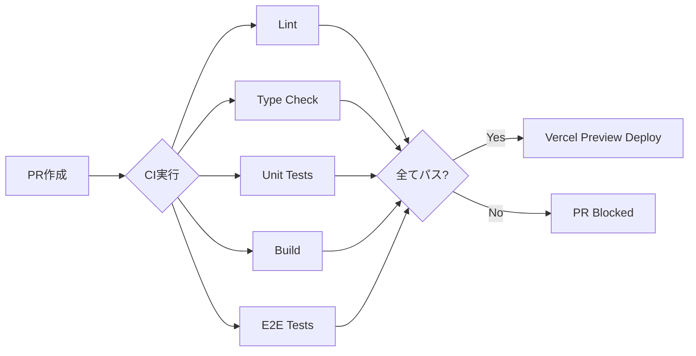
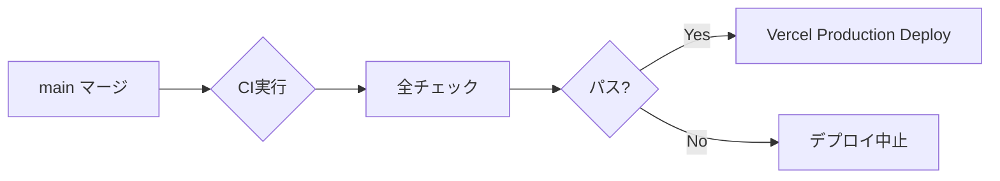

# CI/CD 設定ガイド

ちゅぶれびゅ！プロジェクトのCI/CD（継続的インテグレーション・継続的デプロイ）設定について説明します。

## 📋 概要

### CI/CDの目的

- **コード品質の自動保証**: Lint/Type Check/Testの自動実行
- **バグの早期発見**: PR作成時に自動テスト
- **デプロイの自動化**: mainマージ時に本番環境へ自動デプロイ
- **チーム開発の効率化**: レビュー前に品質チェック完了

### 使用技術

- **CI**: GitHub Actions
- **デプロイ**: Vercel
- **テスト**: Vitest (Unit), Playwright (E2E)

## 🔄 CI/CDフロー

### 1. Pull Request作成時



### 2. mainブランチマージ時



## 🛠️ セットアップ手順

### 1. GitHub Actions設定（完了済み）

以下のワークフローが自動実行されます：

- `.github/workflows/ci.yml`: Lint, Type Check, Unit Tests, Build
- `.github/workflows/e2e.yml`: E2E Tests

### 2. GitHub Secrets設定（E2Eテスト用）

GitHubリポジトリの設定でSecretsを追加します：

#### 手順

1. GitHubリポジトリ > **Settings**
2. **Secrets and variables** > **Actions**
3. **New repository secret** をクリック
4. 以下のSecretsを追加：

| Secret名 | 説明 | 取得方法 |
|---------|------|----------|
| `NEXT_PUBLIC_SUPABASE_URL` | SupabaseプロジェクトURL | Supabase Dashboard > Settings > API |
| `NEXT_PUBLIC_SUPABASE_ANON_KEY` | Supabase匿名キー | Supabase Dashboard > Settings > API |
| `YOUTUBE_API_KEY` | YouTube Data API v3キー | Google Cloud Console > API & Services > Credentials |
| `SUPABASE_SERVICE_ROLE_KEY` | Supabaseサービスロールキー | Supabase Dashboard > Settings > API（⚠️注意深く扱う） |

> **⚠️ セキュリティ注意**:
> - Secretsは絶対にコードにコミットしない
> - `SUPABASE_SERVICE_ROLE_KEY`は特に機密性が高い
> - ローカルでは`.env.local`を使用（gitignore済み）

### 3. Vercel連携設定

#### Vercelプロジェクト作成

1. [Vercel Dashboard](https://vercel.com/dashboard)にアクセス
2. **Add New** > **Project**
3. GitHubリポジトリを選択（`tube-review`）
4. **Import**をクリック

#### フレームワーク設定

Vercelが自動検出しますが、念のため確認：

- **Framework Preset**: Next.js
- **Root Directory**: `./`
- **Build Command**: `npm run build`
- **Output Directory**: `.next`

#### 環境変数設定

1. Vercel Dashboard > プロジェクト > **Settings** > **Environment Variables**
2. 以下の環境変数を追加（**Preview**と**Production**両方にチェック）：

| 変数名 | 値 | 環境 |
|--------|-----|------|
| `NEXT_PUBLIC_SUPABASE_URL` | `https://xxx.supabase.co` | Preview, Production |
| `NEXT_PUBLIC_SUPABASE_ANON_KEY` | `eyJhbGc...` | Preview, Production |
| `YOUTUBE_API_KEY` | `AIzaSy...` | Preview, Production |
| `SUPABASE_SERVICE_ROLE_KEY` | `eyJhbGc...` | Preview, Production |

#### デプロイ設定

1. **Git** タブで以下を確認：
   - **Production Branch**: `main`
   - **Auto-deploy**: ON（デフォルト）

2. **Deployment Protection**（オプション）：
   - Vercel Pro以上で利用可能
   - Preview DeployにPassword保護を設定可能

## 🧪 ローカルでのCI確認

PR作成前にローカルで全チェックを実行できます：

```bash
# 1. Lint
npm run lint

# 2. Type Check
npx tsc --noEmit

# 3. Unit Tests
npm run test:unit

# 4. Build
npm run build

# 5. E2E Tests（オプション）
npm run test:e2e
```

### 一括実行スクリプト

全チェックを一度に実行：

```bash
npm run lint && npx tsc --noEmit && npm run test:unit && npm run build
```

## 📊 CI実行結果の確認

### GitHub Actions

1. GitHubリポジトリ > **Actions**タブ
2. 最新のワークフロー実行をクリック
3. 各ジョブの結果を確認

#### ステータスバッジ

README.mdにCI状態を表示（オプション）：

```markdown

```

### Vercel Deployment

1. PR作成時、Vercel botがコメントを投稿
2. Preview URLにアクセスして動作確認
3. mainマージ後、Production URLで確認

## 🐛 トラブルシューティング

### CI失敗時の対処

#### 1. Lint エラー

```bash
# エラー箇所を確認
npm run lint

# 自動修正
npm run lint -- --fix

# 修正後コミット
git add .
git commit -m "fix: lint errors"
git push
```

#### 2. Type Check エラー

```bash
# エラー箇所を確認
npx tsc --noEmit

# 型定義を修正してコミット
```

#### 3. Unit Test 失敗

```bash
# 失敗したテストを確認
npm run test:unit

# 特定のテストのみ実行
npm run test:unit -- path/to/test.test.ts

# 修正後、再実行
npm run test:unit
```

#### 4. Build エラー

```bash
# ビルドエラーの詳細を確認
npm run build

# よくある原因:
# - 環境変数不足 → .env.example参照
# - TypeScriptエラー → npx tsc --noEmit
# - 構文エラー → npm run lint
```

#### 5. E2E Test 失敗

```bash
# ローカルで実行
npm run test:e2e

# ヘッドレスモードOFFでデバッグ
npm run test:e2e -- --headed

# GitHub Secretsが正しく設定されているか確認
```

### Vercel デプロイ失敗時の対処

#### ビルドエラー

1. Vercel Dashboard > Deployments > 失敗したデプロイ
2. **Building**ログを確認
3. エラーメッセージに従って修正

よくある原因：
- 環境変数不足 → Vercel Settings > Environment Variables
- メモリ不足 → Pro以上のプランが必要な場合あり
- ビルドタイムアウト → 最適化が必要

#### デプロイ後のエラー

1. Vercel Dashboard > Deployments > **Function Logs**
2. Runtime Logsを確認
3. エラーメッセージに従って修正

よくある原因：
- Supabase接続エラー → 環境変数確認
- YouTube API制限 → クォータ確認
- RLSポリシーエラー → データベース設定確認

## 🔒 セキュリティベストプラクティス

### 環境変数管理

✅ **DO**:
- GitHub SecretsとVercel Environment Variablesで管理
- `.env.local`は必ずgitignore
- `.env.example`でテンプレート提供

❌ **DON'T**:
- APIキーをコードに直書き
- Secretsをコミット
- 本番環境の変数をPRコメントに貼り付け

### デプロイ保護

- 本番環境のSupabaseとPreview環境を分離（推奨）
- Vercel Deployment Protectionでパスワード保護（Pro以上）
- GitHub Branch Protectionで直接mainへのPushを禁止

## 📈 パフォーマンス最適化

### CI実行時間短縮

現在の目標: **5分以内**

最適化手法：
- ✅ npm ciでキャッシュ活用（setup-node@v4）
- ✅ ジョブの並列実行（Lint, Type Check, Test, Build）
- ✅ E2Eテストは別ワークフローで実行

### Vercelビルド時間短縮

- Next.jsのSWC（Rust）ビルドツール使用
- Turbopackの活用（開発時）
- 不要な依存関係の削除

## 📚 参考資料

- [GitHub Actions Documentation](https://docs.github.com/en/actions)
- [Vercel Documentation](https://vercel.com/docs)
- [Next.js Deployment](https://nextjs.org/docs/pages/building-your-application/deploying)
- [Playwright CI Guide](https://playwright.dev/docs/ci)

## 🎯 チェックリスト

### 初回セットアップ

- [x] GitHub Actionsワークフロー作成
- [ ] GitHub Secrets設定
- [ ] Vercelプロジェクト作成
- [ ] Vercel環境変数設定
- [ ] Vercel自動デプロイ有効化

### PR作成前

- [ ] `npm run lint`でLintチェック
- [ ] `npx tsc --noEmit`で型チェック
- [ ] `npm run test:unit`でユニットテスト
- [ ] `npm run build`でビルド確認

### デプロイ前

- [ ] CIが全てパス
- [ ] Preview DeployでUI確認
- [ ] E2Eテストがパス（オプション）
- [ ] セキュリティチェック完了

---

**最終更新**: 2026-02-08
