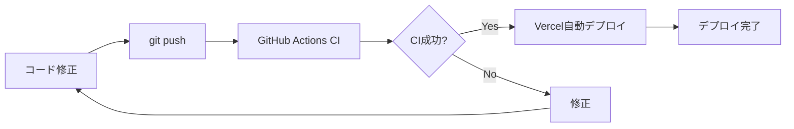

# デプロイガイド

TubeReviewプロジェクトのデプロイ手順です。

## 📋 目次

- [デプロイの流れ](#デプロイの流れ)
- [初回デプロイ](#初回デプロイ)
- [継続的デプロイ](#継続的デプロイ)
- [ロールバック](#ロールバック)
- [環境別設定](#環境別設定)
- [デプロイ後の確認](#デプロイ後の確認)
- [トラブルシューティング](#トラブルシューティング)

## 🔄 デプロイの流れ



### 環境とブランチの対応

| 環境 | ブランチ | デプロイタイミング | URL |
|------|---------|-------------------|-----|
| **Development** | ローカル | 手動（`npm run dev`） | `http://localhost:3000` |
| **Preview** | feature/* | Pull Request作成時 | `https://tube-review-xxx.vercel.app` |
| **Production** | main | mainへのマージ時 | `https://your-domain.vercel.app` |

## 🚀 初回デプロイ

### 前提条件

以下が完了していることを確認：

- [ ] [環境構築](./ENVIRONMENT_SETUP.md)完了
- [ ] Supabase本番環境設定完了
- [ ] YouTube API本番キー取得完了
- [ ] Vercelプロジェクト作成完了
- [ ] 環境変数設定完了

### ステップ1: ローカルでビルド確認

```bash
# 依存関係を最新化
npm install

# Lint確認
npm run lint

# Type Check確認
npx tsc --noEmit

# Unit Tests実行
npm run test:unit

# Production ビルド
npm run build

# ビルド成功を確認
ls -la .next
```

全てのチェックがパスすることを確認。

### ステップ2: GitHub Actions確認

1. GitHubリポジトリの **Actions** タブを開く
2. 最新のワークフロー実行を確認
3. 全てのジョブ（Lint, Type Check, Test, Build）が成功していることを確認

### ステップ3: Vercelで初回デプロイ

#### 自動デプロイ（推奨）

```bash
# mainブランチにプッシュ
git checkout main
git pull origin main

# （変更がある場合）コミット＆プッシュ
git add .
git commit -m "feat: initial production deployment"
git push origin main
```

Vercelが自動的にデプロイを開始します。

#### 手動デプロイ（オプション）

```bash
# Vercel CLIをインストール
npm install -g vercel

# Vercelにログイン
vercel login

# 本番デプロイ
vercel --prod
```

### ステップ4: デプロイ確認

1. **Vercel Dashboard** > **Deployments** を開く
2. 最新のデプロイメントの状態を確認
3. **Visit** をクリックして本番URLにアクセス
4. サイトが正常に表示されることを確認

## 🔁 継続的デプロイ

### Pull Request作成時（Preview環境）

```bash
# feature ブランチで作業
git checkout -b feature/new-feature

# コード修正
# ...

# コミット＆プッシュ
git add .
git commit -m "feat: add new feature"
git push origin feature/new-feature
```

1. GitHub でPull Requestを作成
2. GitHub Actions CIが自動実行される
3. CI成功後、Vercel がPreview環境をデプロイ
4. VercelボットがPRにPreview URLをコメント
5. Preview URLで動作確認
6. レビュー＆承認後、mainにマージ

### mainマージ時（Production環境）

```bash
# Pull Request承認後、mainにマージ
# （GitHubのUIで実行）
```

1. mainにマージされると自動的にCI実行
2. CI成功後、Vercelが本番環境にデプロイ
3. デプロイ完了通知を受け取る
4. 本番URLで動作確認

### ホットフィックス（緊急修正）

```bash
# mainブランチから直接修正（緊急時のみ）
git checkout main
git pull origin main

# 修正
# ...

# コミット＆プッシュ
git add .
git commit -m "hotfix: critical bug fix"
git push origin main
```

⚠️ **注意**: 通常はfeatureブランチ→PR→マージの流れを推奨

## ⏪ ロールバック

### 方法1: Vercel Dashboard（推奨）

1. **Vercel Dashboard** > **Deployments** を開く
2. ロールバックしたいデプロイメントを探す
3. **⋯** メニュー > **Promote to Production** をクリック
4. 確認ダイアログで **Promote** をクリック

### 方法2: Git Revert

```bash
# 問題のあるコミットを特定
git log --oneline

# コミットをrevert
git revert <commit-hash>

# プッシュ
git push origin main
```

Vercelが自動的に新しいデプロイメントを作成し、問題のある変更が取り消される。

### 方法3: Vercel CLI

```bash
# デプロイメント一覧を表示
vercel list

# 特定のデプロイメントをプロモート
vercel promote <deployment-url> --prod
```

## 🌍 環境別設定

### Development（ローカル）

**設定ファイル**: `.env.local`

```bash
NEXT_PUBLIC_SUPABASE_URL=https://dev-project.supabase.co
NEXT_PUBLIC_SUPABASE_ANON_KEY=dev-anon-key
YOUTUBE_API_KEY=dev-youtube-api-key
SUPABASE_SERVICE_ROLE_KEY=dev-service-role-key
```

**起動方法**:
```bash
npm run dev
```

### Preview（ステージング）

**設定場所**: Vercel > Settings > Environment Variables > Preview

- Pull Request作成時に自動デプロイ
- 本番と同じ環境変数を使用（推奨）
- または専用のステージング環境を用意

**URL形式**: `https://tube-review-<hash>.vercel.app`

### Production（本番）

**設定場所**: Vercel > Settings > Environment Variables > Production

- mainブランチへのマージ時に自動デプロイ
- 本番用の環境変数を使用
- カスタムドメイン設定可能

**URL**: `https://your-domain.vercel.app`

## ✅ デプロイ後の確認

### 1. スモークテスト

以下の機能が正常に動作するか確認：

- [ ] **トップページ**: 表示される
- [ ] **ランキング**: データが表示される
- [ ] **チャンネル検索**: YouTube APIが動作する
- [ ] **ログイン**: Supabase Authが動作する
- [ ] **レビュー投稿**: データベースに保存される
- [ ] **画像アップロード**: Supabase Storageが動作する
- [ ] **マイリスト**: ユーザーデータが表示される

### 2. パフォーマンス確認

```bash
# Lighthouse CI（オプション）
npm install -g @lhci/cli

# パフォーマンス測定
lhci autorun --url=https://your-domain.vercel.app
```

目標スコア:
- **Performance**: 90+
- **Accessibility**: 90+
- **Best Practices**: 90+
- **SEO**: 90+

### 3. エラー監視

1. **Vercel Dashboard** > **Logs** を確認
2. エラーがないか確認
3. Sentryを設定している場合はエラーレートを確認

### 4. データベース確認

```sql
-- Supabase Dashboard > SQL Editor

-- ユーザー数確認
SELECT COUNT(*) FROM users;

-- レビュー数確認
SELECT COUNT(*) FROM reviews WHERE deleted_at IS NULL;

-- チャンネル数確認
SELECT COUNT(*) FROM channels;

-- 統計データ確認
SELECT COUNT(*) FROM channel_stats;
```

## 🐛 トラブルシューティング

### ビルドエラー

**エラー**: `Error: Failed to compile`

**確認事項**:
1. ローカルで`npm run build`が成功するか
2. TypeScriptエラーがないか（`npx tsc --noEmit`）
3. 環境変数が正しく設定されているか
4. `package.json`の依存関係が正しいか

**解決策**:
```bash
# キャッシュクリア
rm -rf .next node_modules package-lock.json

# 再インストール
npm install

# ビルド
npm run build
```

### デプロイエラー

**エラー**: `Error: Deployment failed`

**確認事項**:
1. Vercelの環境変数が設定されているか
2. ビルドログを確認
3. Vercelの制限に達していないか（無料プランの場合）

**解決策**:
- Vercel Dashboard > Deployments > ログを確認
- エラーメッセージに従って修正

### ランタイムエラー

**エラー**: サイトは表示されるが機能が動作しない

**確認事項**:
1. Vercel > Function Logs でエラーを確認
2. ブラウザのコンソールでエラーを確認
3. Supabase接続が正常か確認
4. YouTube API接続が正常か確認

**解決策**:
```bash
# 環境変数を確認
vercel env ls

# 環境変数を再設定
vercel env rm NEXT_PUBLIC_SUPABASE_URL production
vercel env add NEXT_PUBLIC_SUPABASE_URL production
```

### パフォーマンス問題

**症状**: サイトが遅い

**確認事項**:
1. 画像が最適化されているか（next/image使用）
2. バンドルサイズが大きすぎないか
3. Supabase接続プールが有効か（Pro以上）
4. CDNが有効か

**解決策**:
- 画像最適化: `next/image`を使用
- バンドル分析: `npm run build -- --analyze`
- Supabase Connection Pooling有効化

## 📊 デプロイメトリクス

### 推奨デプロイ頻度

- **Development**: 随時
- **Preview**: 1日1-5回（feature開発時）
- **Production**: 1日1-2回（安定版のみ）

### デプロイ時間目標

- **Build Time**: < 3分
- **Deployment Time**: < 5分
- **Total Time**: < 8分

### 成功率目標

- **CI Success Rate**: > 95%
- **Deployment Success Rate**: > 98%
- **Rollback Rate**: < 2%

## 📚 参考リソース

- [Vercel Deployment Documentation](https://vercel.com/docs/deployments/overview)
- [Next.js Deployment](https://nextjs.org/docs/deployment)
- [Supabase Production Checklist](https://supabase.com/docs/guides/platform/going-into-prod)
- [GitHub Actions Documentation](https://docs.github.com/en/actions)

## 🔐 セキュリティチェックリスト

デプロイ前に確認：

- [ ] 環境変数がVercelで管理されている（コードに直書きされていない）
- [ ] `.env.local`がgitignoreされている
- [ ] Supabase RLSポリシーが有効
- [ ] YouTube APIキーにリファラー制限がある
- [ ] HTTPSが有効（Vercelはデフォルトで有効）
- [ ] セキュリティヘッダーが設定されている（`next.config.ts`）

---

**最終更新**: 2026-02-08
