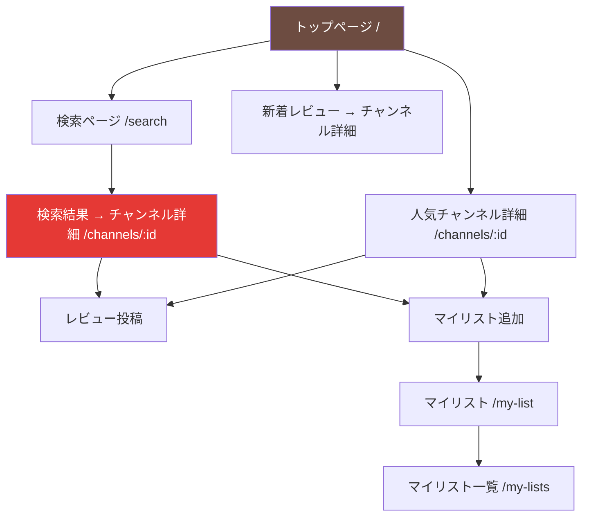
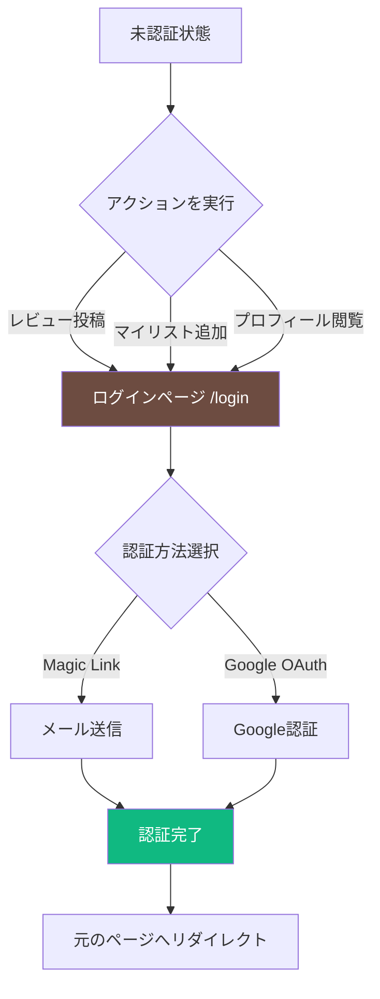
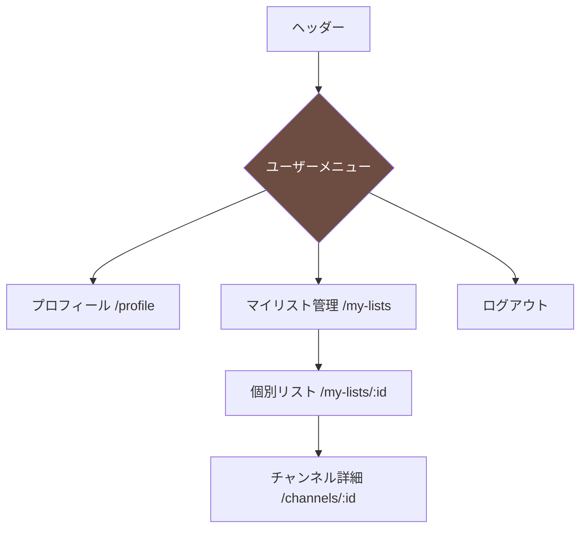

# ナビゲーション設計

> **作成日**: 2026-02-05
> **目的**: 画面遷移とナビゲーション構成の問題を整理し、統一的な設計を定義する

## 問題の概要

現在のアプリケーションには以下のナビゲーション設計上の問題が存在します：

### 1. 共通レイアウトの不統一

**現状**:
- トップページ（`/`）のみが`<Layout>`コンポーネントを使用
- その他のページは`<Layout>`を使用せず、ヘッダー・フッターが表示されない

| ページ | パス | Layout使用 | ヘッダー | フッター |
|-------|------|-----------|---------|---------|
| トップページ | `/` | ✅ | ✅ | ✅ |
| 検索ページ | `/search` | ❌ | ❌ | ❌ |
| チャンネル詳細 | `/channels/[id]` | ❌ | ❌ | ❌ |
| マイリスト | `/my-list` | ❌ | ❌ | ❌ |
| マイリスト一覧 | `/my-lists` | ❌ | ❌ | ❌ |
| プロフィール | `/profile` | ❌ | ❌ | ❌ |
| ログイン | `/login` | ❌ | ❌ | ❌ |
| サインアップ | `/signup` | ❌ | ❌ | ❌ |

**影響**:
- ユーザーがページ間を自由に移動できない
- チャンネル詳細ページからトップページに戻れない
- 検索ページから他のページに遷移できない
- プロフィールページが孤立している

### 2. ヘッダーナビゲーションの不整合

**現在のヘッダーリンク** (`components/layout/header.tsx`):
```tsx
- トップ → /
- ランキング → /ranking (ページが存在しない❌)
- 新着 → /new (ページが存在しない❌)
- マイリスト → /my-list
```

**実装されているページ**:
- `/` - トップページ（ランキング機能を含む）
- `/search` - 検索ページ（ヘッダーにリンクがない❌）
- `/channels/[id]` - チャンネル詳細
- `/my-list` - マイリスト
- `/my-lists` - マイリスト一覧（ヘッダーにリンクがない❌）
- `/profile` - プロフィール（ヘッダーにリンクがない❌）
- `/login` - ログイン（ヘッダーにリンクがない❌）
- `/signup` - サインアップ

**問題点**:
- 存在しないページへのリンク（404エラー）
- 実装済みページへのアクセス手段がない
- ユーザー認証状態に応じた表示分岐がない

### 3. ブレッドクラムの欠如

現在、どのページにもブレッドクラムが実装されていないため、ユーザーが現在地を把握しにくい。

**特に問題となるページ**:
- チャンネル詳細ページ → 検索結果やランキングから遷移したが戻れない
- レビュー詳細ページ → どこから来たか分からない

---

## 解決策

### Phase 1: 全ページへのLayoutコンポーネント適用

すべてのページで`<Layout>`コンポーネントを使用するように修正します。

**対象ファイル**:
```
app/
├── search/page.tsx
├── channels/[id]/page.tsx
├── my-list/page.tsx
├── my-lists/page.tsx
├── profile/page.tsx
├── (auth)/
│   ├── login/page.tsx
│   └── signup/page.tsx
```

**例外**:
- ログイン・サインアップページは専用の簡易レイアウトを使用（認証フローに集中）

### Phase 2: ヘッダーナビゲーションの再設計

#### 2-1. 実装するページの整理

| 優先度 | ページ名 | パス | 説明 | 実装状況 |
|-------|---------|------|------|---------|
| 🔥 最高 | トップページ | `/` | ヒーロー + 人気ランキング + 新着レビュー | ✅ 実装済み |
| 🔥 最高 | 検索ページ | `/search` | チャンネル検索 | ✅ 実装済み |
| 🔥 最高 | チャンネル詳細 | `/channels/[id]` | チャンネル情報・レビュー一覧 | ✅ 実装済み |
| 🔥 高 | マイリスト | `/my-list` | 見たい・見ている・見た | ✅ 実装済み |
| 中 | マイリスト一覧 | `/my-lists` | 複数リスト管理 | ✅ 実装済み |
| 中 | プロフィール | `/profile` | ユーザー情報 | ✅ 実装済み |
| 低 | ランキング専用ページ | `/ranking` | ❌ 未実装（トップページで代用） |
| 低 | 新着専用ページ | `/new` | ❌ 未実装（トップページで代用） |

#### 2-2. 新しいヘッダー構成

**基本ナビゲーション**:
```tsx
<nav>
  <Link href="/">トップ</Link>
  <Link href="/search">検索</Link>
  <Link href="/my-list">マイリスト</Link>
</nav>
```

**ユーザーメニュー（右端）**:
```tsx
{user ? (
  <DropdownMenu>
    <DropdownMenuTrigger>
      <Avatar src={user.avatar} />
    </DropdownMenuTrigger>
    <DropdownMenuContent>
      <DropdownMenuItem>
        <Link href="/profile">プロフィール</Link>
      </DropdownMenuItem>
      <DropdownMenuItem>
        <Link href="/my-lists">マイリスト管理</Link>
      </DropdownMenuItem>
      <DropdownMenuSeparator />
      <DropdownMenuItem>
        <button onClick={handleSignOut}>ログアウト</button>
      </DropdownMenuItem>
    </DropdownMenuContent>
  </DropdownMenu>
) : (
  <Link href="/login">
    <Button>ログイン</Button>
  </Link>
)}
```

### Phase 3: ブレッドクラムの実装

各ページに適切なブレッドクラムを追加します。

**例: チャンネル詳細ページ**
```
トップ > 検索結果 > チャンネル名
```

**例: マイリストページ**
```
トップ > マイリスト
```

**例: プロフィール**
```
トップ > プロフィール
```

### Phase 4: 「戻る」ボタンの追加

詳細ページには「戻る」ボタンを設置します。

**実装方法**:
```tsx
import { useRouter } from 'next/navigation';

function BackButton() {
  const router = useRouter();

  return (
    <button onClick={() => router.back()}>
      <ArrowLeft /> 戻る
    </button>
  );
}
```

---

## 画面遷移フロー図

### メインフロー



### 認証フロー



### ユーザーメニューフロー



---

## 実装計画

### タスク一覧

#### Task 1: Layoutコンポーネント統一 ⏱️ 2h（優先度: priority-high）
- [ ] `app/search/page.tsx` に `<Layout>` 追加
- [ ] `app/channels/[id]/page.tsx` に `<Layout>` 追加
- [ ] `app/my-list/page.tsx` に `<Layout>` 追加
- [ ] `app/my-lists/page.tsx` に `<Layout>` 追加
- [ ] `app/profile/page.tsx` に `<Layout>` 追加
- [ ] E2Eテストで各ページのヘッダー・フッター表示確認

#### Task 2: ヘッダーコンポーネント改修 ⏱️ 3h（優先度: priority-high）
- [ ] `components/layout/header.tsx` を修正
  - [ ] 存在しないリンク（/ranking, /new）を削除
  - [ ] 検索リンク追加
  - [ ] ユーザーメニュー追加（Avatar + Dropdown）
  - [ ] 認証状態に応じた表示切り替え
  - [ ] モバイル対応（ハンバーガーメニュー）
- [ ] shadcn/ui の DropdownMenu コンポーネント導入
- [ ] ログアウト機能実装

#### Task 3: ブレッドクラム実装 ⏱️ 2h（優先度: priority-medium）
- [ ] `components/ui/breadcrumb.tsx` コンポーネント作成
- [ ] チャンネル詳細ページにブレッドクラム追加
- [ ] マイリストページにブレッドクラム追加
- [ ] プロフィールページにブレッドクラム追加

#### Task 4: 「戻る」ボタン実装 ⏱️ 1h（優先度: priority-medium）
- [ ] `components/ui/back-button.tsx` コンポーネント作成
- [ ] チャンネル詳細ページに「戻る」ボタン追加
- [ ] レビュー詳細ページに「戻る」ボタン追加（将来）

#### Task 5: 認証リダイレクト改善 ⏱️ 1h（優先度: priority-medium）
- [ ] 未認証時のリダイレクト元URL保存
- [ ] 認証後に元のページへリダイレクト
- [ ] E2Eテストで認証フロー確認

---

## ページ別ナビゲーション仕様

### 1. トップページ (`/`)

**ナビゲーション要素**:
- ヘッダー: トップ（現在地）、検索、マイリスト
- フッター: サイト情報、コピーライト

**アクション**:
- 人気チャンネルカード → `/channels/:id`
- 新着レビュー → `/channels/:id`
- 検索ボタン → `/search`

### 2. 検索ページ (`/search`)

**ナビゲーション要素**:
- ヘッダー: トップ、検索（現在地）、マイリスト
- ブレッドクラム: `トップ > 検索`

**アクション**:
- チャンネルカード → `/channels/:id`
- 検索フォーム送信 → `/search?q=...`

### 3. チャンネル詳細ページ (`/channels/:id`)

**ナビゲーション要素**:
- ヘッダー: トップ、検索、マイリスト
- ブレッドクラム: `トップ > チャンネル名`
- 「戻る」ボタン

**アクション**:
- マイリスト追加ボタン → モーダル表示
- レビュー投稿 → その場で投稿（リロード）
- YouTubeで見る → 新しいタブで開く

### 4. マイリストページ (`/my-list`)

**ナビゲーション要素**:
- ヘッダー: トップ、検索、マイリスト（現在地）
- ブレッドクラム: `トップ > マイリスト`

**アクション**:
- チャンネルカード → `/channels/:id`
- ステータスタブ切り替え → `/my-list?status=...`
- マイリスト管理 → `/my-lists`

### 5. マイリスト一覧ページ (`/my-lists`)

**ナビゲーション要素**:
- ヘッダー: トップ、検索、マイリスト
- ブレッドクラム: `トップ > マイリスト管理`

**アクション**:
- リストカード → `/my-lists/:id`
- リスト作成ボタン → モーダル表示

### 6. プロフィールページ (`/profile`)

**ナビゲーション要素**:
- ヘッダー: トップ、検索、マイリスト
- ブレッドクラム: `トップ > プロフィール`

**アクション**:
- 編集ボタン → 編集モード切り替え
- 自分のレビュー → `/channels/:id`

### 7. ログイン・サインアップページ (`/login`, `/signup`)

**ナビゲーション要素**:
- 簡易ヘッダー: ロゴのみ
- フッターなし

**アクション**:
- ログイン成功 → リダイレクト元 or `/`
- アカウント作成リンク → `/signup`
- ログインリンク → `/login`

---

## モバイル対応

### ハンバーガーメニュー

画面幅768px未満でハンバーガーメニューに切り替え。

**メニュー内容**:
```
📱 メニュー
├── トップ
├── 検索
├── マイリスト
├─── （ログイン済み）
│   ├── プロフィール
│   ├── マイリスト管理
│   └── ログアウト
└─── （未ログイン）
    └── ログイン
```

---

## 参照ドキュメント

- `docs/WIREFRAME.md` - ワイヤーフレーム設計
- `docs/UI_DESIGN.md` - デザインシステム
- `docs/EPIC_ISSUE_BREAKDOWN.md` - 実装計画
- `docs/AUTH_FLOW.md` - 認証フロー

---

## 次のアクション

1. **Task 1を最優先で実施**: 全ページに`<Layout>`を適用してナビゲーションを統一
2. **Task 2でヘッダー改修**: 実装済みページへのリンクを正しく設定
3. **Task 3-5は順次対応**: ユーザビリティ向上のための追加機能

この設計に基づいて実装を進めることで、ユーザーがアプリケーション内をスムーズに移動できるようになります。
