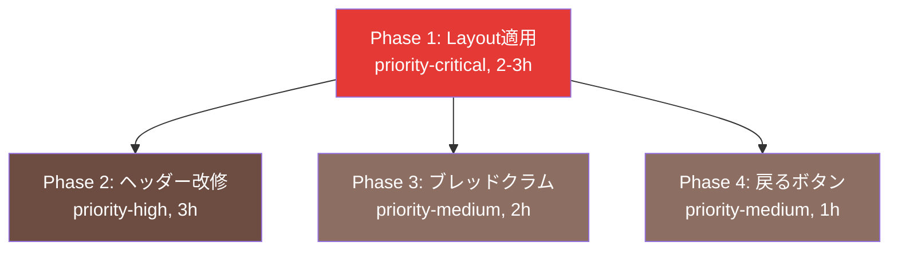

# ナビゲーション修正イシュー一覧

> **作成日**: 2026-02-05
> **関連ドキュメント**: `docs/NAVIGATION_DESIGN.md`

## 概要

現在のアプリケーションには、ナビゲーション設計に重大な問題があります。トップページ以外のすべてのページでヘッダー・フッターが表示されておらず、ユーザーがページ間を自由に移動できない状態です。

この問題を解決するため、4つのPhaseに分けて段階的に改善します。

---

## 📋 イシュー一覧

### Phase 1: 全ページへのLayoutコンポーネント適用 🔥

**ファイル**: `navigation-fix-phase1.md`

| 項目 | 内容 |
|------|------|
| **優先度** | 🔥 priority-critical (Critical) |
| **サイズ** | M (2-3時間) |
| **ラベル** | `enhancement`, `priority-critical`, `M` |
| **依存** | なし |
| **Blocks** | Phase 2, 3, 4 |

**概要**:
トップページ以外のすべてのページに`<Layout>`コンポーネントを適用し、ヘッダー・フッターを表示します。これにより、ユーザーがページ間を自由に移動できるようになります。

**対象ページ**:
- `/search` - 検索ページ
- `/channels/[id]` - チャンネル詳細
- `/my-list` - マイリスト
- `/my-lists` - マイリスト一覧
- `/profile` - プロフィール

**受入基準**:
- [ ] すべての対象ページでヘッダー・フッターが表示される
- [ ] レイアウト崩れがない
- [ ] E2Eテストがパス

**GitHubイシュー作成コマンド**:
```bash
gh issue create \
  --title "enhance: 🔥【緊急】全ページへのLayoutコンポーネント適用" \
  --body-file docs/issues/navigation-fix-phase1.md \
  --label "enhancement,priority-critical,M"
```

---

### Phase 2: ヘッダーナビゲーション改修とユーザーメニュー実装

**ファイル**: `navigation-fix-phase2.md`

| 項目 | 内容 |
|------|------|
| **優先度** | priority-high (High) |
| **サイズ** | M (3時間) |
| **ラベル** | `enhancement`, `priority-high`, `M` |
| **依存** | Phase 1 |
| **Blocks** | なし |

**概要**:
ヘッダーナビゲーションを再設計し、存在しないページへのリンクを削除、実装済みページへのリンクを追加します。また、ユーザーメニュー（プロフィール、ログアウト）とモバイル対応を実装します。

**主な変更**:
- 存在しないリンク（/ranking, /new）を削除
- 検索ページへのリンクを追加
- ユーザーメニュー実装（shadcn/ui DropdownMenu）
- モバイルメニュー実装（shadcn/ui Sheet）
- ログアウト機能実装

**受入基準**:
- [ ] 存在しないリンクが削除されている
- [ ] 検索ページへのリンクが表示される
- [ ] ユーザーメニューが機能する
- [ ] モバイル対応完了
- [ ] E2Eテストがパス

**GitHubイシュー作成コマンド**:
```bash
gh issue create \
  --title "enhance: ヘッダーナビゲーション改修とユーザーメニュー実装" \
  --body-file docs/issues/navigation-fix-phase2.md \
  --label "enhancement,priority-high,M"
```

---

### Phase 3: ブレッドクラム実装でユーザーの現在地把握を改善

**ファイル**: `navigation-fix-phase3.md`

| 項目 | 内容 |
|------|------|
| **優先度** | priority-medium (Medium) |
| **サイズ** | S (2時間) |
| **ラベル** | `enhancement`, `priority-medium`, `S` |
| **依存** | Phase 1 |
| **Blocks** | なし |

**概要**:
主要ページにブレッドクラムを追加し、ユーザーが現在地を把握しやすくします。また、構造化データ（JSON-LD）を追加してSEOを改善します。

**主な変更**:
- shadcn/ui Breadcrumbコンポーネント追加
- 各ページ用ブレッドクラムコンポーネント作成
- 構造化データ（BreadcrumbList）追加

**受入基準**:
- [ ] すべての対象ページでブレッドクラムが表示される
- [ ] ブレッドクラムから上位ページに遷移できる
- [ ] 構造化データが正しく出力される
- [ ] E2Eテストがパス

**GitHubイシュー作成コマンド**:
```bash
gh issue create \
  --title "enhance: ブレッドクラム実装でユーザーの現在地把握を改善" \
  --body-file docs/issues/navigation-fix-phase3.md \
  --label "enhancement,priority-medium,S"
```

---

### Phase 4: 戻るボタンと認証リダイレクト改善

**ファイル**: `navigation-fix-phase4.md`

| 項目 | 内容 |
|------|------|
| **優先度** | priority-medium (Medium) |
| **サイズ** | XS (1時間) |
| **ラベル** | `enhancement`, `priority-medium`, `XS` |
| **依存** | Phase 1 |
| **Blocks** | なし |

**概要**:
詳細ページに「戻る」ボタンを追加し、ユーザーが前のページに素早く戻れるようにします。また、未認証ユーザーが認証後に元のページに自動で戻れるようリダイレクト機能を改善します。

**主な変更**:
- BackButtonコンポーネント作成
- チャンネル詳細ページに追加
- Middleware改修（redirectパラメータ追加）
- ログイン・サインアップページ改修

**受入基準**:
- [ ] 「戻る」ボタンが表示される
- [ ] 「戻る」ボタンが機能する
- [ ] 認証後に元のページにリダイレクトされる
- [ ] セキュリティ確認（リダイレクトURLバリデーション）
- [ ] E2Eテストがパス

**GitHubイシュー作成コマンド**:
```bash
gh issue create \
  --title "enhance: 戻るボタンと認証リダイレクト改善" \
  --body-file docs/issues/navigation-fix-phase4.md \
  --label "enhancement,priority-medium,XS"
```

---

## 📊 全体サマリー

### 優先順位

```
Phase 1 (priority-critical, 2-3h) 🔥 最優先 - すぐに実装
    ↓
Phase 2 (priority-high, 3h)        高優先度 - Phase 1完了後すぐに
    ↓
Phase 3 (priority-medium, 2h)      中優先度 - 余裕があれば
Phase 4 (priority-medium, 1h)      中優先度 - 余裕があれば
```

### 合計見積もり時間

- **最小構成（Phase 1のみ）**: 2-3時間
- **推奨構成（Phase 1-2）**: 5-6時間
- **完全実装（Phase 1-4）**: 8-9時間

### 依存関係グラフ



---

## 🚀 実装の進め方

### ステップ1: イシューを作成

上記のコマンドを使用して、GitHub Issuesに登録します。

**一括作成スクリプト** (オプション):
```bash
#!/bin/bash

# Phase 1
gh issue create \
  --title "enhance: 🔥【緊急】全ページへのLayoutコンポーネント適用" \
  --body-file docs/issues/navigation-fix-phase1.md \
  --label "enhancement,priority-critical,M"

# Phase 2
gh issue create \
  --title "enhance: ヘッダーナビゲーション改修とユーザーメニュー実装" \
  --body-file docs/issues/navigation-fix-phase2.md \
  --label "enhancement,priority-high,M"

# Phase 3
gh issue create \
  --title "enhance: ブレッドクラム実装でユーザーの現在地把握を改善" \
  --body-file docs/issues/navigation-fix-phase3.md \
  --label "enhancement,priority-medium,S"

# Phase 4
gh issue create \
  --title "enhance: 戻るボタンと認証リダイレクト改善" \
  --body-file docs/issues/navigation-fix-phase4.md \
  --label "enhancement,priority-medium,XS"
```

### ステップ2: Phase 1を最優先で実装

```bash
# ブランチ作成
git checkout -b enhance/navigation-phase1

# 実装
# ...

# コミット
git add .
git commit -m "enhance: 全ページへのLayoutコンポーネント適用

- search/page.tsxにLayout追加
- channels/[id]/page.tsxにLayout追加
- my-list/page.tsxにLayout追加
- my-lists/page.tsxにLayout追加
- profile/page.tsxにLayout追加
- E2Eテスト追加

Closes #XX"

# PR作成
gh pr create --title "enhance: 全ページへのLayoutコンポーネント適用" --body "Closes #XX"
```

### ステップ3: Phase 2以降を順次実装

Phase 1のPRがマージされたら、Phase 2に取り掛かります。

---

## 📚 関連ドキュメント

- `docs/NAVIGATION_DESIGN.md` - ナビゲーション設計全体
- `docs/UI_DESIGN.md` - デザインシステム
- `docs/EPIC_ISSUE_BREAKDOWN.md` - 開発計画
- `.github/ISSUE_TEMPLATE/enhancement.md` - イシューテンプレート

---

## ✅ 完了チェックリスト

### Phase 1
- [ ] イシュー作成
- [ ] 実装完了
- [ ] E2Eテスト完了
- [ ] PRマージ

### Phase 2
- [ ] イシュー作成
- [ ] 実装完了
- [ ] E2Eテスト完了
- [ ] PRマージ

### Phase 3
- [ ] イシュー作成
- [ ] 実装完了
- [ ] E2Eテスト完了
- [ ] PRマージ

### Phase 4
- [ ] イシュー作成
- [ ] 実装完了
- [ ] E2Eテスト完了
- [ ] PRマージ

---

## 📝 メモ

- Phase 1は緊急対応のため、最優先で実装してください
- Phase 2-4は、Phase 1完了後に順次対応可能です
- Phase 3と4は並行実装可能（ファイル競合なし）
- すべてのPhaseでE2Eテストを必ず作成してください
